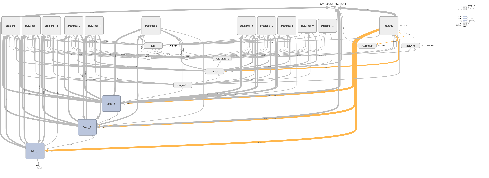
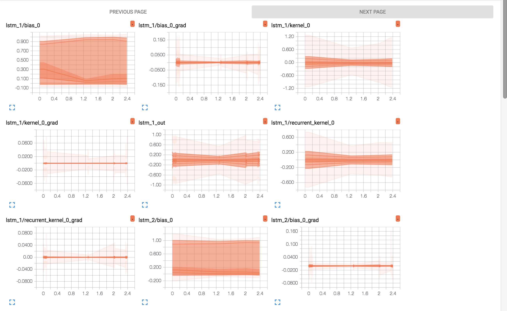

# Training a Recurrent Neural Network for Text Generation

[](LICENSE)


This implements a char-rnn, as made famous by
[Andrei Karpathy's work](http://karpathy.github.io/2015/05/21/rnn-effectiveness/) on
text generation using recurrent neural networks.

# Training on GPU vs CPU
It is recommended to run this script on GPU, as recurrent networks are quite computationally intensive. If access to GPU optimized tensorflow is not available, it's sometimes possible to find precompiled binaries on Github.

I have compiled some optimized [tensorflow binaries](https://github.com/jjangsangy/MacOS-TensorflowBuilds) for `MacOS` that people can use running the latest tensorflow and utilizing Intel Math Kernel Library.

# Corpus Sizes
Make sure your corpus has >100k characters at least, but for the best >1M characters. Relatively, that is around the size, of Harry Potter Book 7.

# Architecture

We implement a 3 Layer Stateful LSTM in Keras

```
_________________________________________________________________
Layer (type)                 Output Shape              Param #
=================================================================
lstm_1 (LSTM)                (None, 40, 128)           110080
_________________________________________________________________
lstm_2 (LSTM)                (None, 40, 128)           131584
_________________________________________________________________
lstm_3 (LSTM)                (None, 128)               131584
_________________________________________________________________
dropout_1 (Dropout)          (None, 128)               0
_________________________________________________________________
output (Dense)               (None, 86)                11094
_________________________________________________________________
activation_1 (Activation)    (None, 86)                0
```

# Installation

Currently only runs on Python 3, you can install dependencies using `pip`

```
$ pip3 install -r requirements.txt
```

## Training

Place your corpuse[s] into the `datasets` folder and run

```sh
$ python3 train.py
```

To customize the parameters for generating text you can parameterize with input arguments.

```sh
$ python3 train.py --help

usage: train.py [-h] [--verbose] [--batch size] [--model file]
                [--window length] [--log_dir directory] [--layers deep]
                [--dropout amount] [--skip amount]

Train a neural network

optional arguments:
  -h, --help            show this help message and exit
  --verbose, -v         Keras verbose output
  --batch size, -b size
                        Specify the input batch size
  --model file, -m file
                        Specify the output model hdf5 file to save to:
                        [default]: models/model.h5
  --window length, -w length
                        Specify the size of the window size to train on:
                        [default]: 40
  --log_dir directory, -r directory
                        Specify the output directory for tensorflow logs:
                        [default]: None
  --layers deep, -l deep
                        Specify the number of layers deep of LSTM nodes:
                        [default]: 3
  --dropout amount, -d amount
                        Amount of LSTM dropout to apply between 0.0 - 1.0:
                        [default]: 0.2
  --skip amount, -s amount
                        Amount to skip within the dataset, integer from 1:
                        [default]: 1
```

## Text Generation

```sh
$ python3 decoder.py
```

## Debugging

To debug we've written log files in the log directory. In order to access these logs, you can run tensorboard.

```sh
$ tensorboard --logdir=./logs
```


